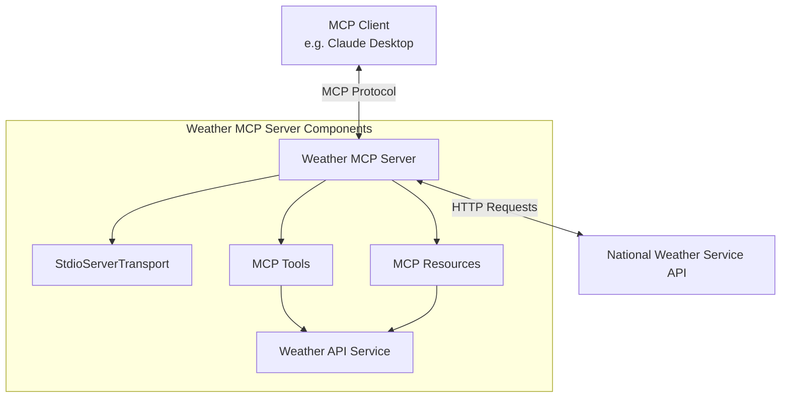

# Weather MCP Server System Patterns

## System Architecture

## Key Technical Decisions

1. **TypeScript Implementation**: Using TypeScript for strong typing and better development experience. This helps enforce correct usage of the MCP SDK and reduces runtime errors.

2. **MCP Protocol Communication**: Implementing the Model Context Protocol for standardized communication between the server and LLM clients.

3. **National Weather Service API**: Using the US National Weather Service API as the data source due to its reliability, comprehensive coverage, and free access.

4. **Command-Line Interface**: Implementing the server as a command-line application for easy deployment and connection to clients like Claude Desktop.

5. **StdioServerTransport**: Using standard input/output for communication with MCP clients, as recommended by the MCP specification.

6. **Tool-based Architecture**: Exposing functionality primarily through MCP tools rather than resources for dynamic interaction.

## Design Patterns

1. **Dependency Injection**: Using class-based architecture with injectable services for better testability and separation of concerns.

2. **Factory Pattern**: Creating utilities for formatting weather data and generating responses.

3. **Service Pattern**: Encapsulating external API calls in a dedicated service layer.

4. **Error Handling Strategy**: Implementing comprehensive error handling at multiple levels to provide graceful degradation.

5. **Request/Response Pattern**: Following the MCP protocol's request/response pattern for all client interactions.

## Component Relationships

### MCP Server
- Central component that coordinates all operations
- Registers tools and handles incoming requests
- Manages connections through the transport layer

### Tools
1. **get_forecast**: Tool for retrieving weather forecasts
   - Accepts latitude/longitude parameters
   - Returns formatted forecast data

2. **get_alerts**: Tool for retrieving weather alerts
   - Accepts US state code parameter
   - Returns formatted alerts data

### API Service
- Handles all interactions with the National Weather Service API
- Implements error handling and retry logic
- Formats raw API responses into structured data

### Transport Layer
- Handles communication with the MCP client
- Uses standard input/output for message passing
- Serializes/deserializes MCP protocol messages

## Data Flow

1. Client sends a request to the MCP Server through the transport layer
2. Server identifies the appropriate tool to handle the request
3. Tool invokes the API Service to fetch required data
4. API Service makes HTTP requests to the National Weather Service
5. Server formats the response and returns it through the transport layer
6. Client receives the formatted response
